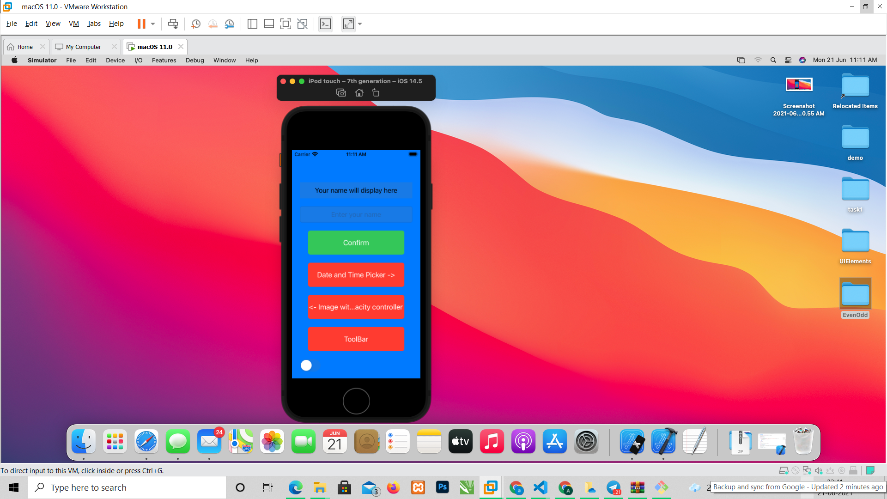
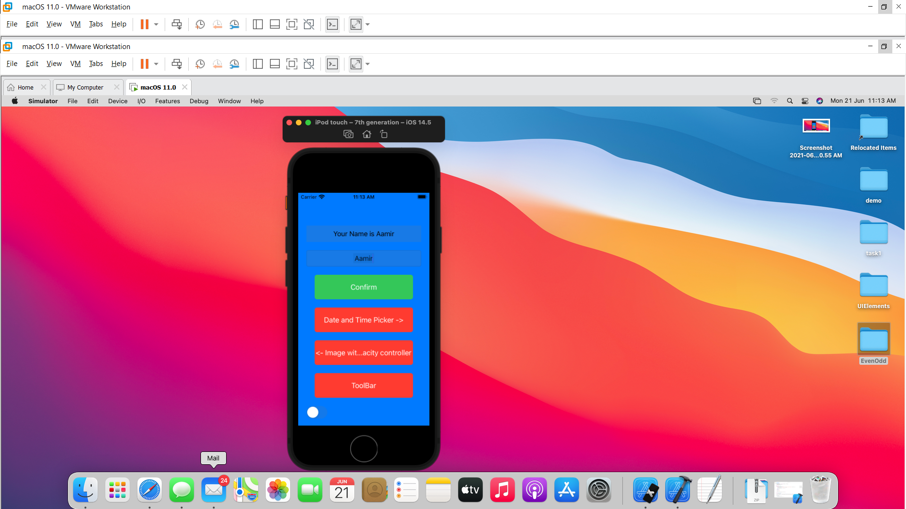
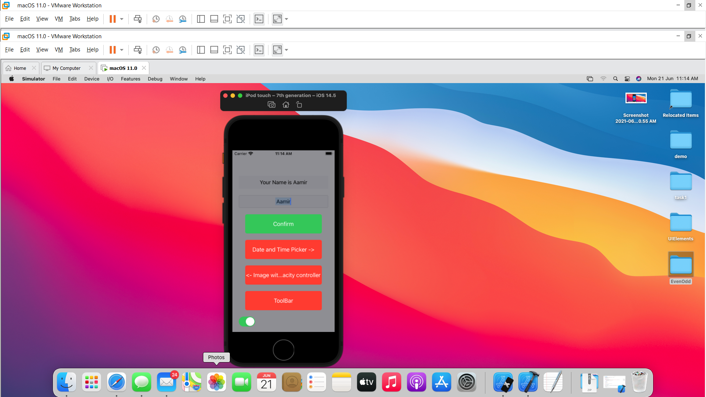
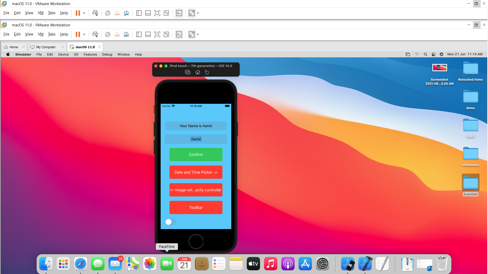
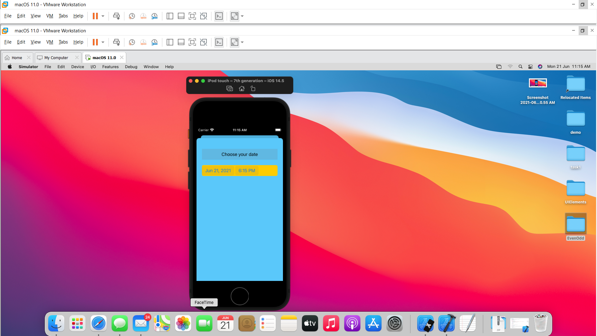
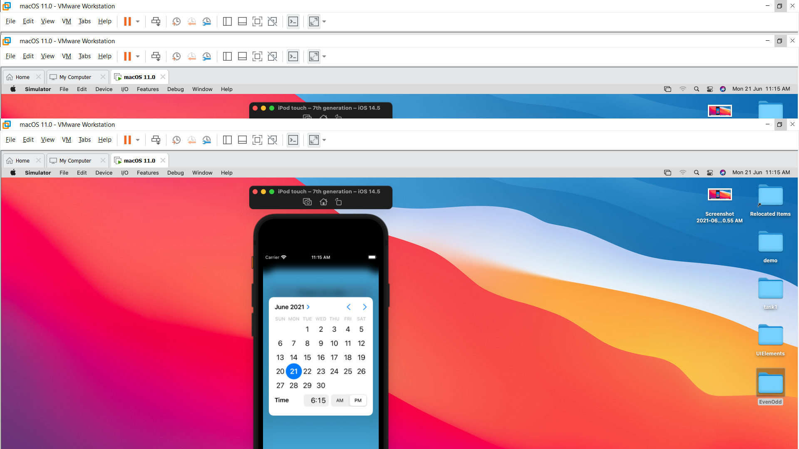
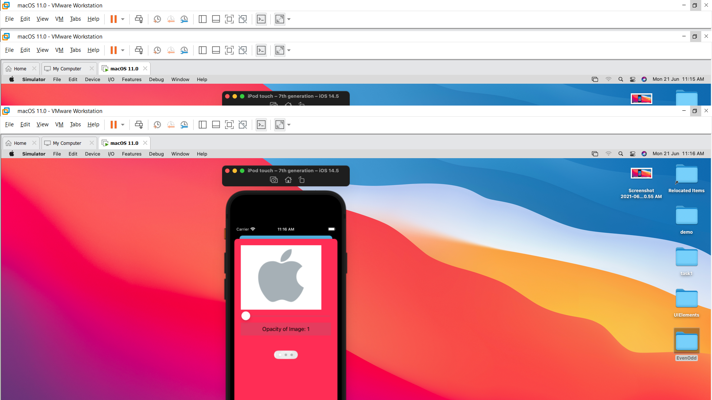
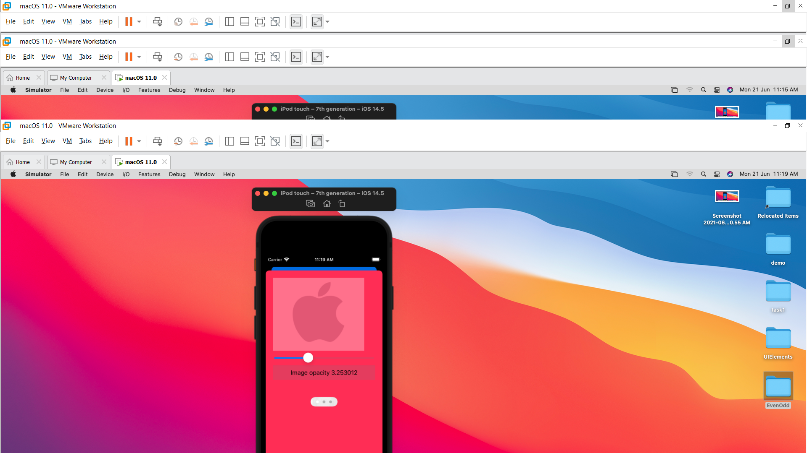
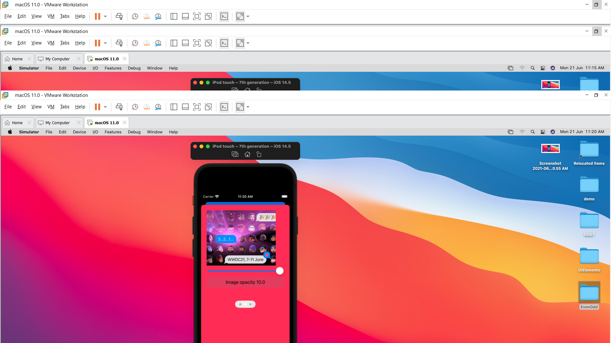
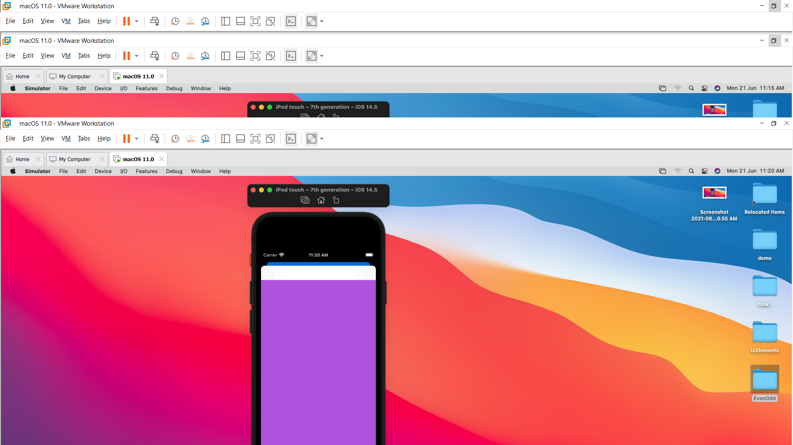

# UIElements
This Application is perform following task:
First screenshot define first page ui
There is two buttons.

First button is use to define date and time picker

Second button is use to define Image opacity

Third button is use to define toolbar
Second screenshot define that if user input his/her name in textfield at that time after clicking button of submit it will the label change and print message.
Third screenshot define work of switch.

Here Default background of the system is diffetern but after clicking switch button the background change with pink color.

After clicking on again switch background change with another colour.
Now, Click on "Date and Time picker ->" it will open subviewcontroller.

As we can show on screenshot 5 there is one date and time picker after choosing any date from that it will print date differnce of current date diffrence from that choosen date.
It will shown differnce on week as well as months.

Now after clicking Image opacity the new view controller will open,

Which has default image in imageview after click page selection it will change images.

Slider is mainlly use to change opacity of image.

Toolbar button redirect on ToolBarVC which is perform verious task like select image from the allery.
There is one cancel button at the top which is use to turminate current view controller.
